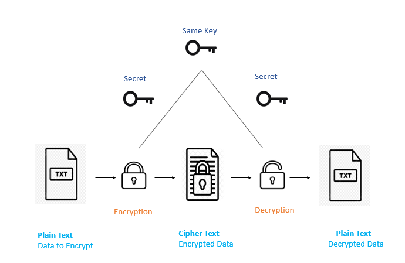

<h1 align="center" id="title">VitaFile</h1>

<p align="center"></p>

<p id="description">VitaFile leverages Google's advanced APIs to revolutionize health record management by <b>centralizing and simplifying access to family EHRs</b>, <b>enhancing security</b>, and <b>promoting interactive user engagement</b> through innovative technology, for a seamless health management experience.</p>
<p>In the critical but often overlooked phase after exiting the hospital, <b>VitaFile plays a pivotal role</b>. It ensures that patients and their families continue to have streamlined access to their health records, enabling continuous care and health monitoring. This <b>bridges the gap between hospital care and home recovery</b>, making VitaFile an essential tool for post-discharge health management.</p>
<p align="center"><i>"Bridging the Gap in Post-Discharge Health Management"</i></p>

<p align="center"></p>
<br>
<h2>Project: </h2>
<br>
  <br>

  - Login with the credentials used during sign-up. Or sign-in using Google Auth, for <b>fast and seamless</b> login.<br>

  <br>
  -  You can add family members  on your Family Page, and manage their health records from a <b>single dashboard.</b><br>

  <br>
  -  View your loved ones' records in a <b>timeline</b> format, and easily upload new reports with the upload card.<br>

  <br>

  -  Search across all your reports using key words and recieve the EHRs using our <b>Integrated Search Feature</b>, to save time and find the document in an instant.<br>

  <br>
  - Google Translate to the top <b>5 languages of the world</b>. The Chatbot feature equipped  with text-to-speech and speech-to-text for those with special needs. Summarizer and the actual report, to provide a one stop solution for all.<br>

<h2>🧐 Features</h2>

 * 🔐 **Firebase & Google Auth:** Secures user data and authentication, ensuring real-time synchronization and robust security.
*  🧠 **Google Gemini API:** Provides advanced health analytics, organizing medical records efficiently.
*  🗣️ **Text-to-Speech & Speech-to-Text APIs:** Improves accessibility with voice interactions and audible content.
* 📝 **pyTesseract for OCR:** Converts scans to editable text, streamlining health record digitization.
* 🌍 **Google Translate:** Breaks language barriers, offering multilingual support for health documents.
* 🖐️ **Google Palm:** Enhances user experience with gesture recognition for intuitive navigation.
<br>


<h2> 🏗️ Solution Architecture </h2>

<br>

* 🔄 **End-to-End Data Processing:** From Tesseract OCR digitizing written records to Gemini Vision structuring text, and Google's APIs providing multilingual translation and voice interaction, our architecture creates a seamless flow of accessible, interactive health data.

<br>

* 📊 **Data Schema & Security:** The ehr and family tables are encrypted and linked to users, ensuring data integrity and security.

<br>

* **🌐 JWT Authentication Flow** The server and browser interaction using JWTs for login processes guarantees secure sessions.

<h2> 🔒 Data Encryption & Protection </h2>



-  📄 **Data Encryption** All data is encrypted using a symmetric key approach, ensuring that any text file converted to cipher text remains confidential.

-  **🗝 Same Key for Encryption/Decryption:** We employ the same secret key for both encrypting and decrypting data, simplifying key management while maintaining security.

-  **🛡 End-to-End Encryption:** From the moment data is encrypted to the point it is decrypted, it is fully protected, ensuring that sensitive information stays secure during transit and at rest.

-  **🔐 Secure Key Management:** The secret keys are managed securely, ensuring they are inaccessible to unauthorized users and systems.


<h2>🔜 What's Next?</h2>

*  **🩺 Google Healthcare API Integration:** To enhance data management, we're moving to store health records in the **FHIR format**, making data more accessible and interoperable.

-  **📊 BigQuery Analysis:** Leveraging Google Analytics for deeper insights, we'll introduce interactive graphs and models. This aims to give users a clearer understanding of their health through **advanced analytics**.


<h2> 🛣️ The Road Ahead </h2>

- 🚀 **Porting to Flutter**: Transition to Flutter for seamless cross-platform use, improving accessibility.
- 📄 **Multi-page Reports**: Introduce detailed multi-page reports for in-depth health insights.
- 🔔 **Notification Feature**: A smart alert system for frequent disease mentions, prompting medical consultation.

<h2>🛠️ Installation Steps:</h2>

<p> 1. Prerequisites- 

```
1. Node.js >=18.19.0
2. Gemini API key
3. Text to Speech and Speech to Text APIs
4. PaLM API

```
<p>2. Git Clone</p>

```
git clone https://github.com/Team-Cornflakes/VitaFile.git
```
<br>
<p> 3. Start the Frontend </p>

```
cd frontend
npm install
npm run dev
```
<br>

  <p> 4. Setup the Server </p>

```
cd ../backend
pip install -r requirements.txt
python manage.py runserver
```
<br>
  
<p> 5. You are <i><u>Good to Go!</u></i> </p>
<h2> 👥 Contributing to VitaFile </h2>

-  **🐞Report Issues:** If you find a bug or have a suggestion, report it as an issue in the project repository.

-  **💻Submit Pull Requests:** Enhance features or fix bugs by submitting a pull request with your changes.

-  **✨Feature Suggestions:** Have an idea? Propose new features by raising an issue for discussion.

<h2> 📄LICENSE </h2>

Our project is licensed under the MIT License, a decision that reflects our commitment to open-source software and its principles of freedom and collaboration. This licensing choice means that anyone is free to use, modify, and distribute our project, provided they include the original license and copyright notice with their work. By choosing the MIT License, we aim to contribute to the vibrant ecosystem of open-source software, making our project accessible and usable by a broad community of developers and users, fostering innovation and development within this space.

<h2> 🙏 Acknowledgments </h2>

We would like to express our deepest appreciation to all those who provided the possibility to complete this project. A special gratitude we give to:

- **Our Contributors**: For their unwavering commitment and contributions that brought this project to life.

-  **Organizations:** Who supported us with tools, APIs, and resources essential for the development of VitaFile.

-  **Faculty Advisors:** Whose insights and expertise have been invaluable to our project's success.

- **VIT Chennai:** For fostering an environment of innovation and learning that has been the cornerstone of our development journey.
