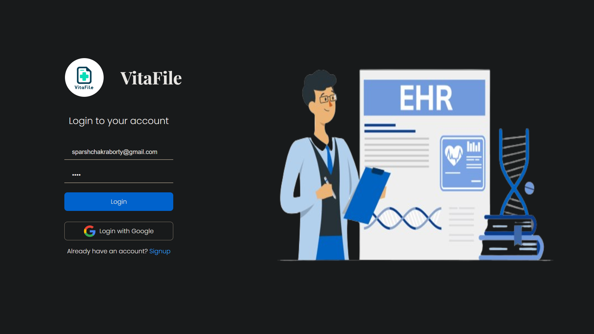
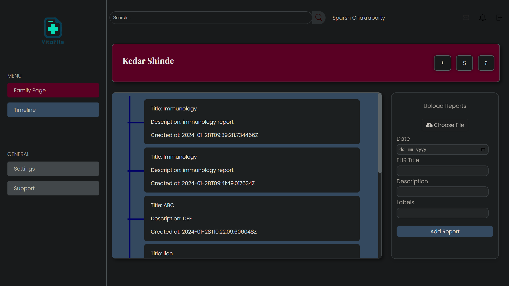

<h1 align="center" id="title">VitaFile</h1>

<p align="center"></p>

<p id="description">VitaFile leverages Google's advanced APIs to revolutionize health record management by centralizing and simplifying access to family EHRs, enhancing security and promoting interactive user engagement through innovative technology, for a seamless health management experience.</p>

<p align="center"></p>
<br>
<h2>Project Screenshots:</h2>
<br>
<p align="center">
  <br>
  <p> Login with the credentials used during sign-up. Or sign-in using Google Auth, for <b>fast and seamless</b> login.</p><br>
  <br>
  <p> You can add family members  on your Family Page, and manage their health records from a <b>single dashboard.</b></p><br>
  <br>
  <p> View your loved ones' records in a <b>timeline</b> format, and easily upload new reports with the upload card.</p><br>
  <br>
  <p> Search across all your reports using key words and recieve the EHRs using our <b>Integrated Search Feature</b>, to save time and find the document in an instant.</p><br>
  <br>
  <p> Google Translate to the top <b>5 languages of the world</b>. The Chatbot feature equipped  with text-to-speech and speech-to-text for those with special needs. Summarizer and the actual report, to provide a one stop solution for all.<br>
</p>

<h2>🧐 Features</h2>

 * 🔐 **Firebase & Google Auth:** Secures user data and authentication, ensuring real-time synchronization and robust security.
*  🧠 **Google Gemini API:** Provides advanced health analytics, organizing medical records efficiently.
*  🗣️ **Text-to-Speech & Speech-to-Text APIs:** Improves accessibility with voice interactions and audible content.
* 📝 **pyTesseract for OCR:** Converts scans to editable text, streamlining health record digitization.
* 🌍 **Google Translate:** Breaks language barriers, offering multilingual support for health documents.
* 🖐️ **Google Palm:** Enhances user experience with gesture recognition for intuitive navigation.
<br>

<h2> 🏗️ Solution Architecture </h2>

<br>

* 🔄 **End-to-End Data Processing:** From Tesseract OCR digitizing written records to Gemini Vision structuring text, and Google's APIs providing multilingual translation and voice interaction, our architecture creates a seamless flow of accessible, interactive health data.

<br>

* 📊 **Data Schema & Security:** The ehr and family tables are encrypted and linked to users, ensuring data integrity and security.

<br>

* **🌐 JWT Authentication Flow** The server and browser interaction using JWTs for login processes guarantees secure sessions.


<h2> 🛣️ The Road Ahead </h2>

- 🚀 **Porting to Flutter**: Transition to Flutter for seamless cross-platform use, improving accessibility.
- 📄 **Multi-page Reports**: Introduce detailed multi-page reports for in-depth health insights.
- 🔔 **Notification Feature**: A smart alert system for frequent disease mentions, prompting medical consultation.
- 📊 **In-depth Analytics with Google Analytics**: Offer users graphical analytics of their medical data, enabling a visual understanding of health trends and patterns.
<h2>🛠️ Installation Steps:</h2>
<br>
<p> 1. Prerequisites- <b>Node.js >=18.19.0</b> </p>

<p>2. Git Clone</p>

```
git clone https://github.com/Team-Cornflakes/VitaFile.git
```
<br>
<p> 3. Start the Frontend </p>

```
cd frontend
npm install
npm run dev
```
<br>

  <p> 4. Setup the Server </p>

```
cd ../backend
pip install -r requirements.txt
python manage.py runserver
```
<br>
  
<p> 5. You are Good to Go! </p>
<br>
<h2>💻 Built with</h2>
<br>

Technologies used in the project:

*   **Django**
*   **React**
*   **Gemini API**
*   **Google Translate**
*   **PaLM API**